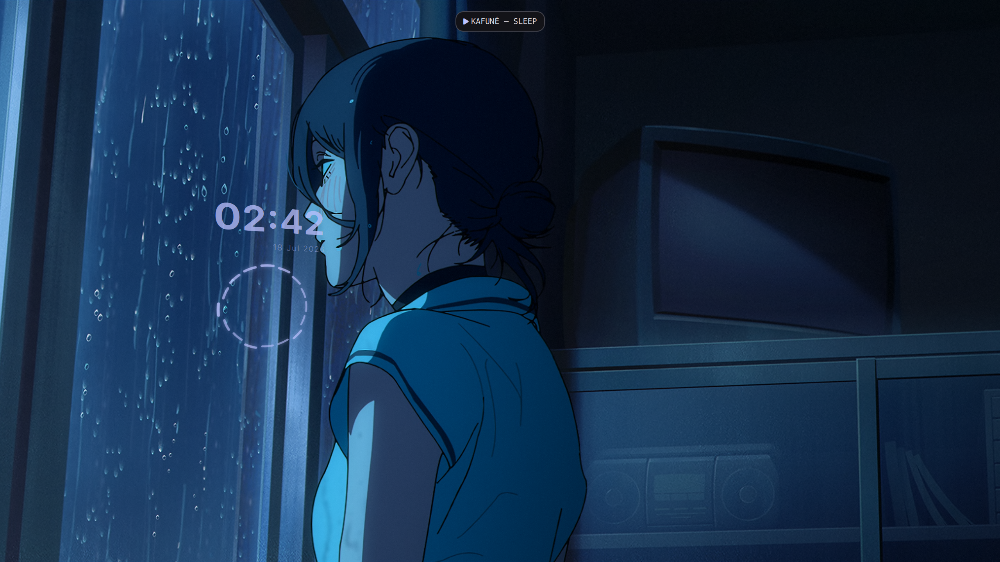
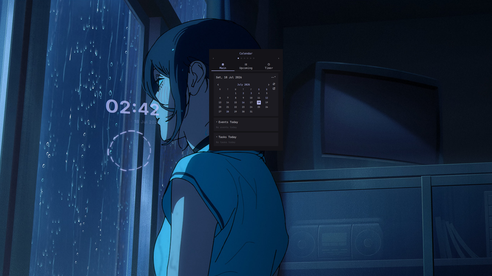
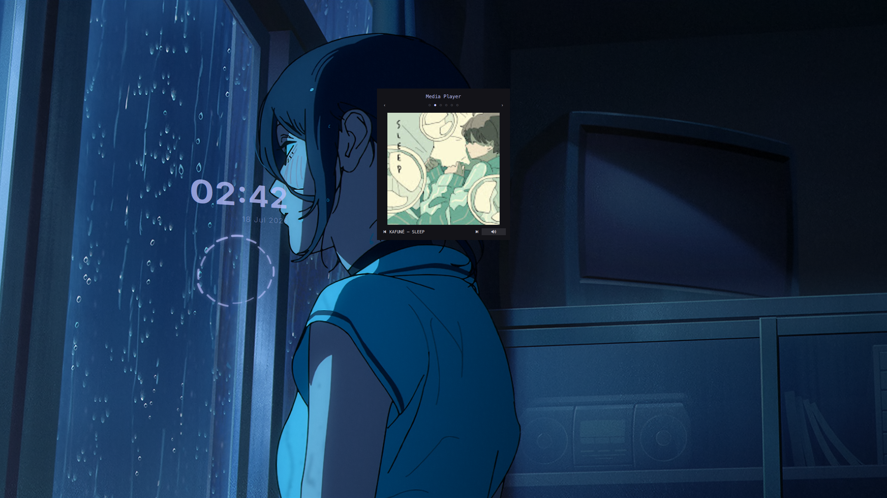
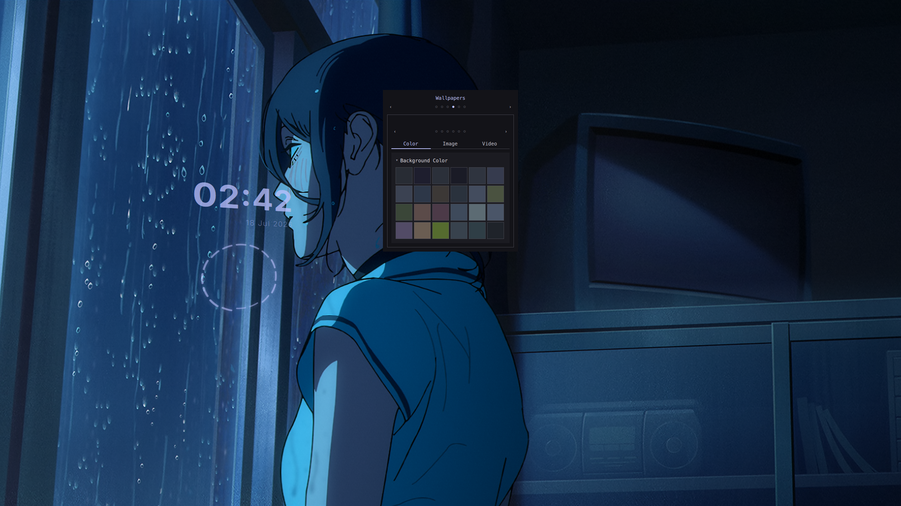

# dotfiles-labwc-quickshell

> CachyOS · labwc · Pillbox · Material You

A Wayland desktop built on [labwc](https://github.com/labwc/labwc). The centrepiece is **Pillbox** — a custom QML shell written in Quickshell that replaces the traditional bar, launcher overlay, and notification daemon with two visual primitives: Pills and Panels.

---

## Preview

| Pill (MPRIS) | Calendar panel |
|---|---|
|  |  |

| Media Player panel | Wallpaper panel |
|---|---|
|  |  |

---

## Stack

| Layer | Tool | Notes |
|---|---|---|
| OS | CachyOS (Arch-based) | |
| Compositor | labwc | wlroots, openbox-like keybinds |
| Shell | Quickshell / Pillbox | QML — see `quickshell/` |
| Launcher | rofi | drun mode (fallback; Pillbox WindowSwitcher handles runtime switching) |
| Notifications | Pillbox (NotificationServer) | built-in D-Bus daemon; no external notifyd |
| Wallpaper | Pillbox (native Qt) | color/image/GIF/video rendered directly; ffmpeg for image and video thumbnails; matugen for color extraction |
| Audio | PipeWire + WirePlumber | |
| Qt theme | Kvantum + Pillbox (Ned-derived) | SVG geometry from [Ned by Jomada](https://gitlab.com/jomada/ned), colors generated by matugen |
| Icons | Papirus-Dark + papirus-nord | Nord colour variant |
| Cursor | Nordzy-cursors-white | |
| Font | JetBrains Mono Nerd Font | all text + Nerd Font glyphs in Pillbox |
| CJK font | Sarasa Mono SC | fontconfig fallback for CJK track names, event titles |

---

## Pillbox

Pillbox replaces the bar stack with two visual primitives:

**Pill** — a rounded rectangle anchored top-centre. Hidden by default. One active at a time. Reveals automatically when there is something worth showing (notification, imminent calendar event, workspace switch, track change), or on demand via hover and the W-1 latch. Priority order (highest wins):

| Priority | Pill | Active when |
|---|---|---|
| 1000 | NotificationPill (critical) | Critical notification, within 10 s of arrival |
| 200 | WindowPill | Window Switcher panel is open |
| 100 | WorkspacePill | Within 1.5 s of a workspace switch |
| 10 | TimePill (urgent) | Next calendar event ≤ 10 min away, or timer/stopwatch active |
| 6 | NotificationPill (normal) | Any notification, within 7 s of arrival |
| 5 | MprisPill | A player is in Playing state with a non-empty track title |
| 1 | TimePill (fallback) | Always — permanent floor; hover/latch always show something |

**Panel** — a larger overlay below the Pill. Opens only on deliberate user action (keybind), closes on the same keybind, ESC, or click-outside. One panel at a time. Left/right arrow keys and floating ‹ › buttons navigate between panels in keybind order.

| Keybind | Panel |
|---|---|
| W-2 | Calendar (events, tasks, weather, timer/stopwatch) |
| W-3 | Media Player (MPRIS — album art, controls, volume) |
| W-4 | Settings (appearance + Google/weather services) |
| W-5 | Wallpaper (colour swatches, image/video browser, slideshow) |
| W-6 | Notifications (scrollable cards, dismiss, actions) |
| W-7 | Control (audio, network, screen recorder, session) |
| W-Tab | Window Switcher (live filter, keyboard nav) |

**W-8** toggles the desktop visualizer overlay (radial cava bars + clock, Bottom layer — behind all windows).

**FIFO bus** — all keybinds and external scripts communicate with Pillbox by writing a command string to `~/.local/share/pillbox/pillbox.fifo`. `FifoListener.qml` tails the pipe and dispatches signals to `shell.qml`.

Full architecture and module specs: `quickshell/docs/`. Start with `quickshell/CLAUDE.md` for a quick orientation.

---

## Theming

### Qt apps
Qt apps do not obey GTK theming. The current solution:
- **Kvantum** — theming engine for Qt6. Uses a custom `Pillbox` theme derived from [Ned by Jomada](https://gitlab.com/jomada/ned) (GPL v3). The SVG geometry is Ned's; colors are generated by matugen on every wallpaper change and written to `~/.config/Kvantum/Pillbox/` automatically.
- **qt6ct** — set to `style=kvantum` with the matugen-generated Pillbox color scheme. `QT_QPA_PLATFORMTHEME=qt6ct` is set in `labwc/environment`.
- **matugen templates** — `matugen/templates/kvantum.svg` and `kvantum.kvconfig` are the source templates. matugen renders them into `~/.config/Kvantum/Pillbox/` on each palette generation.

### Pillbox colors
When "Extract colors" is enabled in Settings → Theme, Pillbox runs matugen against the current wallpaper image (or video thumbnail) on each pick. matugen writes Material You semantic roles to `colors.json`; `Colors.qml` loads that file and feeds the roles into `Style.qml`. Nord-derived values are the static fallback when no extraction has run.

### Icons and cursor
Papirus-Dark + papirus-nord for icons, Nordzy-cursors-white for cursor. Set via Kvantum / qt6ct icon setting.

### Fonts
JetBrains Mono Nerd Font everywhere — terminal, editor, Pillbox text and glyphs. Sarasa Mono SC as CJK fallback (fontconfig).

---

## Notifications

Pillbox owns desktop notifications via its built-in `NotificationServer` (D-Bus daemon, `Quickshell.Services.Notifications`). No external notifyd needed. Notifications appear as a count pill that peeks for 7 s on arrival (red background when critical urgency is present), and the W-6 panel shows scrollable cards with urgency tinting, action buttons, image thumbnails, and right-click or `[×]` dismiss. `clearAll()` dismisses all at once from the panel header.

---

## What's in the repo

```
dotfiles-labwc-quickshell/
├── quickshell/                   ← Pillbox shell (canonical source)
│   ├── CLAUDE.md                 ← session orientation; start here
│   ├── Colors.qml                ← singleton; loaded from matugen colors.json; feeds Style.qml
│   ├── Prefs.qml                 ← user preferences (font sizes, radius, borders, wallpaper state)
│   ├── Style.qml                 ← all visual tokens (Material You roles → semantic names; Nord fallback)
│   ├── shell.qml                 ← ShellRoot; instantiates everything
│   ├── docs/                     ← architecture, modules, style, components, completed work
│   ├── module-panels/            ← CalendarPanel, ControlPanel, MediaPlayerPanel, NotificationPanel,
│   │                                SettingsPanel, SysTrayBar, TimerWidget, WallpaperPanel, WindowSwitcherPanel
│   ├── module-pills/             ← TimePill, WorkspacePill, WindowPill, MprisPill, NotificationPill, ScreenrecPill
│   ├── module-reusable-elements/ ← PillController, PanelController, PanelSurface, ToastWindow, and shared UI components
│   ├── module-toasts/            ← ScreenrecToast, ScreenshotPreview
│   ├── module-visualizer/        ← RadialVisualizer, VisualizerSurface (cava bars + clock overlay)
│   ├── module-window-switcher/   ← WindowSwitcher, WindowSwitcherView, SelectableRow
│   └── root-processes/           ← CalendarProcess, CavaProcess, ClockProcess, FifoListener, MprisProcess,
│                                    NetworkProcess, NotificationServer, ScreenrecProcess, ScreenshotProcess,
│                                    SettingsProcess, TasksProcess, TimerProcess, ToplevelProcess,
│                                    WallpaperProcess, WeatherProcess, WorkspaceProcess, AudioProcess
│
├── helper/
│   ├── calendar/gcal_fetch.py    ← Google Calendar sync (symlinked → ~/.local/bin/gcal-fetch)
│   ├── tasks/gtask_fetch.py      ← Google Tasks sync (symlinked → ~/.local/bin/gtask-fetch)
│   ├── weather/weather_fetch.py  ← Open-Meteo weather (symlinked → ~/.local/bin/weather-fetch)
│   ├── google_auth_notify.sh     ← re-auth desktop notification (symlinked → ~/.local/bin/google-auth-notify)
│   ├── screenshot/               ← pillbox-screenshot, pillbox-screenshot-region scripts
│   ├── screenrec/                ← pillbox-screenrec, pillbox-screenrec-region, pillbox-screenrec-saved scripts
│   └── kitty/kitty-theme.sh      ← kitty colorscheme switcher
│
├── labwc/
│   ├── rc.xml                    ← keybinds and window rules
│   ├── autostart                 ← starts quickshell, bluetooth, polkit agent
│   ├── environment               ← PATH, QT_QPA_PLATFORMTHEME, TERMINAL
│   ├── menu.xml                  ← right-click root/client menu
│   └── icons/                    ← white SVG icons for labwc menu
│
├── matugen/
│   ├── config.toml               ← template list; post_hook triggers kitty + labwc reconfigure
│   └── templates/                ← kvantum.kvconfig, kvantum.svg, colors.json, kitty, labwc themerc
│
├── kvantum/
│   └── kvantum.kvconfig          ← sets active Kvantum theme to Pillbox
│
├── kitty/                        ← kitty terminal config (theme regenerated by matugen)
├── pillbox/                      ← cava.conf, media/ symlinks (Screenshots, Recordings, Replays)
├── scripts/                      ← helper scripts (symlinked → ~/.config/scripts/)
├── dependency                    ← full package list with install commands
└── install.sh                    ← symlinks configs, installs helper scripts, patches qt6ct
```

---

## Keybinds

### Pillbox
| Key | Action |
|---|---|
| `W-1` | Latch pill on/off (persistent toggle) |
| `W-2` | Toggle Calendar panel |
| `W-3` | Toggle Media Player panel |
| `W-4` | Toggle Settings panel |
| `W-5` | Toggle Wallpaper panel |
| `W-6` | Toggle Notifications panel |
| `W-7` | Toggle Control panel (audio, network, session) |
| `W-8` | Toggle desktop visualizer overlay |
| `W-Tab` | Toggle Window Switcher |

### Workspaces
| Key | Action |
|---|---|
| `W-F1` / `W-F2` | Switch to workspace 1 / 2 |
| `W-d` | Show desktop |

### Windows
| Key | Action |
|---|---|
| `A-Tab` / `A-S-Tab` | Cycle windows forward / backward |
| `W-A-x` / `A-F4` | Close window |
| `W-A-f` | Maximize |
| `W-A-d` | Minimize |
| `W-A-Escape` | Toggle decorations |
| `W-←/→/↑/↓` | Snap to edge |
| `W-A-←/→/↑/↓` | Snap to corner |

### Apps
| Key | Action |
|---|---|
| `W-space` | Root menu |
| `W-Escape` | Client menu |
| `W-r` / `A-F2` | Rofi launcher |
| `W-t` | Terminal (`$TERMINAL`) |
| `W-w` | Focus browser or open default browser |
| `W-e` | Focus file manager or open pcmanfm-qt |
| `W-h` | btop |
| `W-v` | pavucontrol-qt |

### Capture
| Key | Action |
|---|---|
| `W-S-s` | Area screenshot (slurp region → clipboard + save) |
| `W-S-d` | Full screenshot (immediate) |
| `W-S-r` | Toggle fullscreen recording |
| `W-S-e` | Pick region and start recording |

### Media keys
| Key | Action |
|---|---|
| `XF86AudioRaiseVolume` | Volume +5% |
| `XF86AudioLowerVolume` | Volume -5% |
| `XF86AudioMute` | Toggle mute |

---

## Install

### 1 — Dependencies

See `dependency` for the full annotated list. Quick install:

```sh
# pacman
sudo pacman -S \
    labwc rofi wlrctl \
    blueman \
    pipewire wireplumber pavucontrol-qt \
    cava \
    gpu-screen-recorder qt6-multimedia grim slurp wl-clipboard imv \
    xdg-desktop-portal xdg-desktop-portal-wlr xdg-desktop-portal-gtk xdg-utils \
    btop \
    kvantum qt6ct \
    papirus-icon-theme \
    ttf-jetbrains-mono-nerd noto-fonts noto-fonts-emoji \
    python-google-api-python-client python-google-auth-oauthlib \
    python-google-auth-httplib2 python-cryptography

# AUR
yay -S quickshell yin nordzy-cursors papirus-nord rofi-polkit-agent ttf-sarasa-gothic
```

### 2 — Clone and install

```sh
git clone https://github.com/weezingwarsong/dotfiles-labwc-quickshell.git ~/Projects/github/dotfiles-labwc-quickshell
cd ~/Projects/github/dotfiles-labwc-quickshell
chmod +x install.sh
./install.sh
```

`install.sh` symlinks `labwc/`, `quickshell/`, `matugen/`, `pillbox/`, `kitty/`, and `scripts/` into `~/.config/`, installs helper scripts to `~/.local/bin/`, links Kvantum theme selector, and patches qt6ct to use Kvantum.

### 3 — Google Calendar / Tasks

Credentials (`~/.config/gcal-quickshell/credentials.json`) are not in the repo. Obtain an OAuth client from Google Cloud Console, place it at that path, then run:

```sh
gcal-fetch --auth
```

This covers both Calendar and Tasks (shared token). After that, Pillbox polls automatically.

---

## Credits

| Work | Author | License |
|---|---|---|
| [Ned](https://gitlab.com/jomada/ned) — Kvantum SVG theme (used as geometry base for `matugen/templates/kvantum.svg` and `kvantum.kvconfig`) | [Jomada](https://gitlab.com/jomada) | GPL v3 |

This repository is licensed under GPL v3 in accordance with the above. See `LICENSE`.

---

## Roadmap

### Pillbox — remaining
- [ ] ScreenrecPill — recording indicator (stub registered; `ScreenrecProcess` is fully implemented, pill visual pending)

### Pillbox — done
- [x] Calendar panel (W-2) — events, tasks, weather, timer/stopwatch
- [x] Media Player panel (W-3) — MPRIS controls, album art, volume, playlist
- [x] Settings panel (W-4) — appearance (typography, padding, corners, borders, panel geometry) + services (Google, weather location)
- [x] Wallpaper panel (W-5) — color picker, image/video browser, slideshow
- [x] Notification panel (W-6) — D-Bus daemon, count pill, scrollable card panel; urgency tinting, actions, thumbnails
- [x] Control panel (W-7) — audio source/sink, network status, screen recorder (oneshot + replay modes), session (exit/reboot/shutdown)
- [x] Desktop visualizer overlay (W-8) — radial cava bars + clock at Bottom layer
- [x] Screenshot system — region, fullscreen; toast with open/copy; scan-on-start history; accessible via Notifications panel → Screenshots tab
- [x] Screen recorder — oneshot + replay modes; region recording via slurp; toast with elapsed timer, open/copy-path
- [x] Window Switcher (W-Tab) — live filter; keyboard navigation
- [x] Notification pill — count display, critical urgency override, thumbnail, action indicator
- [x] matugen color pipeline — wallpaper → matugen → Colors.qml → Style.qml; enabled/disabled via Settings → Theme
- [x] Kvantum / Qt theming — matugen-generated Pillbox theme (SVG from Ned); regenerates on every wallpaper pick
- [x] User preferences — all appearance tokens persist across restarts via Prefs.qml (`~/.config/pillbox.conf`)
